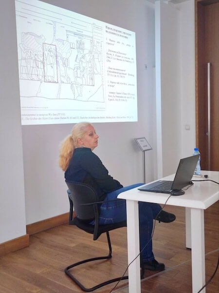
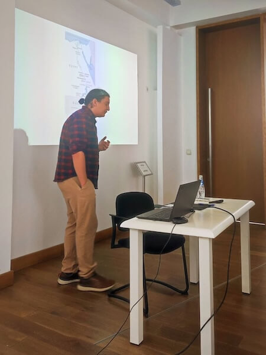

На третата [Национална конференция по египтология](https://news.nbu.bg/bg/events/treta-nacionalna-konferenciq-po-egiptologiq-v-proslava-na-tot!95118), проведена на 19.05.2026 г., Елена Кормева и Милен Миланов - членове на екипа и студенти в Докторска програма на НБУ, изнесоха доклади, свързани с царската идеология през древността.

📌 **Елена Кормева**: "Предаване на титлата _"ṯꜢty"_ в семействата на везирите след края на IV династия"

📌 **Милен Миланов**: "Бележки върху египетските влияния над нубийската владетелска идеология"

