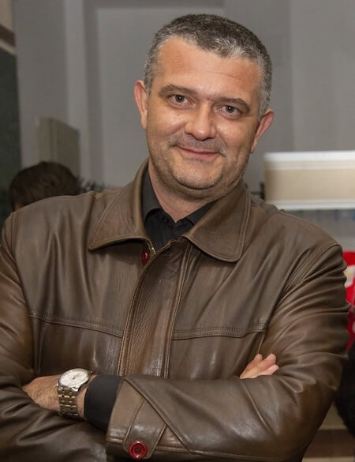
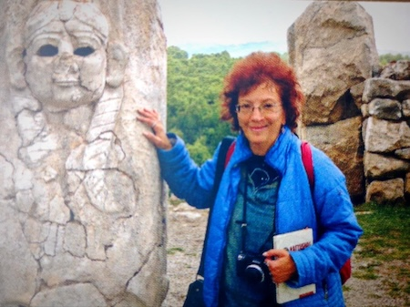
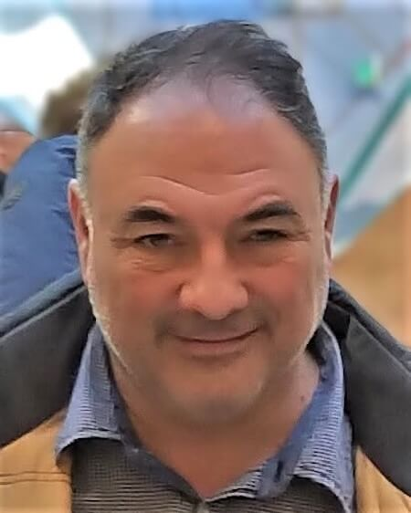
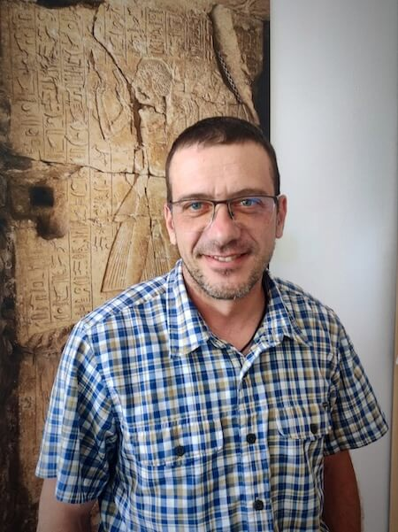

## доц. д-р Емил Бузов

Ръководител на проекта е **доц. д-р Емил Бузов** - учен с богат опит и научна компетентност в областта на египтологията, автор на множество публикации – статии и монографии. 
Докторската му дисертация е на тема _"Древноегипетската дидактична литература ІІІ – ІІ хилядолетие пр. Хр."_, а хабилитацията му е свързана с изследване на ежедневния живот в Древен Египет. Има повече от 20 години преподавателски опит в НБУ, води учебни занятия в СУ “Св. Климент Охридски” като хоноруван преподавател. Дългогодишен директор на Бакалавърска програма “Египтология” и магистърска програма “Древен Египет в класическата епоха”. Секретар е на списание _“The Journal of Egyptological Studies”_, което излиза от 2005 г. Взима участие в археологически разкопки в страната, както и в първата и единствена до момента българска археологическа мисия в Египет - зам. ръководител е на разкопките на Българския институт по египтология към НБУ в Тиванска гробница ТТ 263, които се провеждат от 2012 г. Акцент на изследванията му са древноегипетските дидактични текстове, развитието на военното дело, история на Старо, Средно и Ново царство в Египет.

> [!NOTE] Профил в Academia.edu: [Емил Бузов](https://newbulgarian.academia.edu/EmilBuzov)

---
## доц. д-р Майя Василева

Доц. д-р ст.н.с. **Майя Василева**, член на научния колектив на проекта, е водещ български експерт в областта на хититите и културите на територията на Мала Азия през II-I хил. пр. Хр. Дисертацията ѝ към Института по тракология при БАН е на тема _“Тракия и Фригия: Балкано-анатолийски паралели до 6 в. пр. н. е. включително”_ и е тясно свързана с темата на проекта. Хабилитационният ѝ труд на тема: _„Цар Мидас между Европа и Азия”_. В академичната ѝ кариера се открояват дългогодишен академичен опит в Института по тракология в БАН, специализации в чужбина, включително в колежа “Св. Джон” в Оксфорд, в отдела за изкуство на Близкия Изток в музея “Метрополитън” в Ню Йорк и в Американския изследователски институт в Турция, наред с други. Дългогодишен хоноруван преподавател е в СУ и НБУ. От 2010 година е доцент в НБУ. Автор е на множество публикации, свързани с темата. Доц. Василева е един от водещите специалисти в експертната ѝ област и участието ѝ в проекта е от изключително значение за изследването на пътищата на влияние в Източното Средиземноморие и Близкия Изток в древността. Нейният принос е свързан и с изследването на културните връзки между Балканите и Анадола, като чрез нея проектът ще получи достъп до уникални научни перспективи върху контактите между тези региони.

> [!NOTE] Профил в Academia.edu: [Майя Василева](https://newbulgarian.academia.edu/MayaVassileva)

---
## гл. ас. д-р Борислав Бориславов

Гл. ас. д-р **Борислав Бориславов** (НАИМ-БАН), член на научния ни колектив, е археолог с изключително богат теренен опит като научен ръководител на редица знакови археологически обекти. Утвърден специалист по бронзова и ранножелязна епоха с изразен интерес към култови практики, светилища и некрополи. Сензационните открития в некропола до с. Изворово, Харманли, довели до голям международен интерес, доказват съществуването на елит, който има владетелски, икономически и религиозни функции още през Средната бронзова епоха (началото на II хил. пр. Хр.). Д-р Бориславов има над 20 години преподавателски опит в СУ „Св. Климент Охридски“ и НБУ. Бил е ръководител на проект по ФАР за трансгранично сътрудничество и културен туризъм – _„По стъпките на тракийските богове“_. Ролята му в настоящия проект е ключова по отношение на теренните дейности на територията на България, както и във връзка с изследването на артефакти, свързани с едни от най-ранните данни за владетелски елити на територията на Тракия.

---
## ас. д-р Йордан Чобанов

Ас. д-р **Йордан Чобанов**, член на научния колектив, има защитена дисертация на тема _“Песните на арфиста в контекста на египетската литературна традиция (II хил. пр.Хр. – средата на I хил. пр. Хр.)"_ и публикувана монография _“Красноречивият жител на оазиса. Текстове от Древен Египет II”_. Преподавател е в НБУ и взима участие в разкопките на Българския институт по египтология към НБУ в Египет в Тиванска гробница ТТ 263. Научните му компетенции са в областта на египтологията, древноегипетската литература, древноегипетските заупокойни практики и ритуали, заупокойните и литургични текстове, неизменна част от царската идеология.

> [!NOTE] Профил в Academia.edu: [Йордан Чобанов](https://newbulgarian.academia.edu/YordanChobanov)
