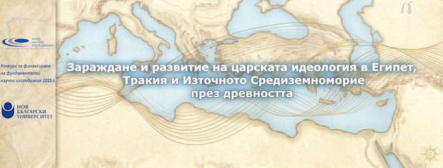

Проектът е насочен към изследване на зараждането и развитието на царската идеология в Древен Египет и нейните културни и материални отражения в Древна Тракия и културите от Източното Средиземноморие. Чрез интердисциплинарен подход, включващ археология, епиграфика, лингвистика, теренни проучвани и анализ на писмени и материални източници, се цели проследяване на идеята за божествения владетел – основен стълб на египетската цивилизация – и влиянието ѝ върху съседните култури.

Един от акцентите на проекта е върху теренните проучвания в Египет – храмове и гробници от Старото и Новото царство, които дават ключова информация за утвърждаването на владетелския култ. По отношения на Тракия ще бъдат анализирани археологически находки от последните две десетилетия в българските земи, които свидетелстват за формиране на елити и сложни социални структури още от III хил. пр. Хр. Специално внимание ще бъде отделено на артефакти от благородни метали, свидетелстващи за владетелски прослойки, които могат да допринесат за установяване на търговски и културни връзки между Тракия, Египет и Източното Средиземноморие. Ще бъдат заснети ключови елементи от знакови археологически паметници като мегалитните обекти от Брезово, скалните структури на „Беланташ“ и тракийското скално светилище „Семерчето“. Проучването ще обхване и сравнителен анализ на архитектурни и декоративни програми на царските гробници, религиозни представи и художествени практики, за да бъдат проследени паралели и взаимни влияния. Резултатите ще бъдат обобщени след установяване на единна методология и терминология, което ще допринесе за по-цялостно и съпоставимо изследване на древните култури.

Проектът предвижда публикуване на научните резултати в международно видими издания, организиране на национална конференция и създаване на сводно двуезично (българо-английско) издание с минимален брой 7 публикации по темата. Като част от проекта ще бъдат организирани редица събития с образователен характер като публични лекции, открити уроци и изложби, които ще допринесат за борбата с лъженауката в тези научни сфери. Реализацията на проекта ще допринесе за утвърждаване на българската египтология на международната научна сцена, като същевременно ще допринесе за по-дълбокото разбиране на културните процеси, оформили основите на съвременната европейска цивилизация.

## Обобщение на целите на проекта

Проектът има за цел да изследва в дълбочина генезиса и развитието на царската идеология в Древен Египет, нейното културно отражение в Тракия и по-широкия регион на Източното Средиземноморие, както и да допринесе за утвърждаването на българската наука в областта на египтологията и тракологията. Чрез интегриране на резултатите от различни дисциплини – археология, епиграфика, лингвистика, история на изкуството и археометрия – ще се постигне комплексно и обективно разбиране за процесите, довели до формирането на владетелски елити и идеологически модели в древността.

За постигане на тази цел са заложени следните конкретни и измерими задачи:

1. **Създаване на база данни** от писмени и материални извори, археологически паметници и научна литература, включително най-новите публикации, свързани с царската идеология в Египет, Тракия и Източното Средиземноморие.
2. **Идентифициране и документиране на археологически находки** от територията на Тракия, свързани с владетелския елит, и извършване на специализирани археометрични анализи (химически, рентгенови, металографски и др.) и 3D заснемане на метални предмети, за които има данни за паралели с аналогични обекти от Египет и региона.
3. **Провеждане на теренни изследвания** в Египет и България, с акцент върху ключови паметници – като слънчевите храмове в Абу Роаш и Абу Гораб и тракийски владетелски гробници – с цел заснемане и анализ на елементи, свързани с представата за царя и владетелския култ.
4. **Сравнителен анализ на архитектурни и декоративни програми** на царски гробници в Египет и Тракия за проследяване на културни влияния и сходни идеологически принципи.
5. **Превод и анализ на древноегипетски текстове** и епиграфски паметници, както и антични извори за Тракия, с цел изясняване на религиозни, политически и културни аспекти на владетелската власт.
6. **Обобщаване на резултатите** от всички изследвания в единна методологична рамка, позволяваща интегрирането на данни от различни дисциплини и ясно дефиниране на културните връзки и посоките на влияние между Египет, Тракия и Източното Средиземноморие.
7. **Популяризиране на научните постижения** чрез организиране на национална конференция и публикуване на минимум 10 научни изследвания, от които 7 в специализирано сводно англоезично издание, достъпно в рамките на принципите на отворената наука.

Изпълнението на тези задачи ще позволи извеждането на нови, научно обосновани изводи за механизмите на формиране и разпространение на царската идеология, която е сред структуроопределящите елементи на древните цивилизации. Получените резултати ще хвърлят светлина върху културните взаимодействия, оказали влияние върху развитието на Тракия и българските земи и ще разкрият тяхната роля в изграждането на основите на съвременната европейска цивилизация.

Проектът има и важно значение в контекста на утвърждаването на българската египтология като видим и уважаван партньор в международните научни мрежи. Египтологията, с дълбоки традиции и глобален престиж, ще бъде поставена в центъра на едно изследване, което ще съчетае оригинални теренни проучвания, аналитични методи и висока публикационна активност.

Освен това, проектът ще даде възможност за противодействие на лъженауката, която често подменя обективната истина с псевдонаучни спекулации, особено по отношение на Древен Египет и Тракия. Чрез представяне на научно обосновани резултати пред академичната общност и широката публика, ще се утвърждават научните стандарти и ще се насърчава критичното мислене. По този начин проектът ще има не само изследователска, но и образователна и културна мисия, с дълготрайно въздействие върху българската и международната хуманитаристика.

> [!NOTE] Вижте още:
> За повече информация относно членовете на екипа и техните научни профили, моля посетете
> [Екип на проекта](/posts/team/)
